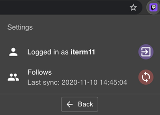

# Twitch Live Extension

A browser extension that will help you to find out when your followed streamers are live on Twitch.
 
To start using it, open the extension, log in with your Twitch account and every time you click on the extension icon
you will see the streamers that you follow that are live.

The first time the extension is opened, it stores yours follows list, as getting them is very time consuming. 
This way, when the extension is used it faster to show the ones that are live. 
This list expires after 1 day and if you click on the extension after that period it wil take 2 seconds more to show the live streams because it's storing the new follows list.

If you don't want to wait 1 day to get the most updated list, if you click on *Settings*, there's a button to refresh the list.
There's also a button to switch the Twitch account you are logged in.

The extension is available on [Chrome Store](https://chrome.google.com/webstore/detail/twitch-live-extension/nlnfdlcbnpafokhpjfffmoobbejpedgj?hl=pt-PT&authuser=0). 

## Settings

In this page you can:
 - Switch Twitch account
 - Refresh the follows list stored

## Available Scripts

Before running any command, you need to create a file with your Twitch Client ID. 
To get one, go to the [Twitch Api page](https://dev.twitch.tv/docs/authentication#registration) and register your app.
 
 After that, create the file `./src/config.ts` with:  
``export const CLIENT_ID = "YOUR_CLIENT_ID";``

### `yarn start`

Runs the app in the development mode with reloading. 
Open [http://localhost:3000](http://localhost:3000) to view it in the browser.

### `yarn test`

Runs all the tests

### `yarn build`

Builds the app for production to the `build` folder without inline scripts. 

## Deployment

- Run `yarn build`.
- Open [chrome://extensions](chrome://extensions)
- Enable `Developer mode`
- Press ``Load unpacked`` and upload the ``build`` folder 

## Frameworks

This extension was developed using [React](https://reactjs.org/), [Redux Toolkit](https://redux-toolkit.js.org/) and [Material-UI](https://material-ui.com/).