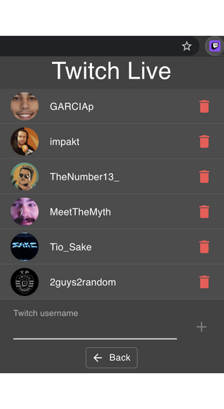
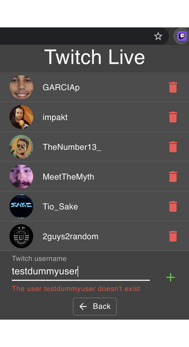
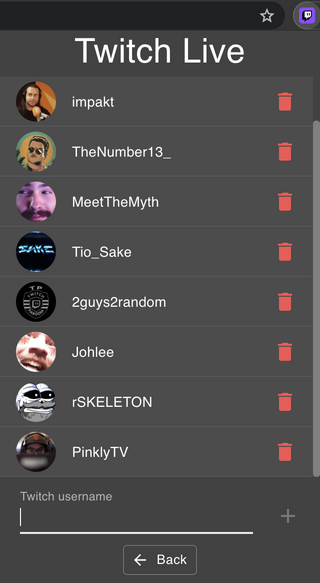

# Twitch Live Extension

A browser extension that shows your favorite streamers live on Twitch.
 
To start using it, open the extension, press _**Options**_ and add the streamers username that you follow.
Every time you open the extension, you will see the live ones and you can click on them to get redirected to their livestream page. There's also a _**Refresh**_ button to update the livestreams list.

The extension is available on [Chrome Store](https://chrome.google.com/webstore/detail/twitch-live-extension/nlnfdlcbnpafokhpjfffmoobbejpedgj?hl=pt-PT&authuser=0). 

### Add a stream

- Open the extension
- Click **_Options_**
- Type the twitch username and press `Enter` or click on `+` button
- If the user doesn't exist or was already added, an error will be prompted

_Note_: The username is case insensitive

### Remove a stream
- Open the extension
- Click **_Options_**
- Press remove button for the desired stream

## Available Scripts

Before running any command, you need to create a file with your Twitch Client ID. 
To get one, go to the [Twitch Api page](https://dev.twitch.tv/docs/authentication#registration) and register your app.
 
 After that, create the file `./src/config.ts` with:  
``export const CLIENT_ID = "YOUR_CLIENT_ID";``

### `yarn start`

Runs the app in the development mode with reloading. 
Open [http://localhost:3000](http://localhost:3000) to view it in the browser.

### `yarn test`

Runs all the tests

### `yarn build`

Builds the app for production to the `build` folder without inline scripts. 

## Deployment

- Run `yarn build`.
- Open [chrome://extensions](chrome://extensions)
- Enable `Developer mode`
- Press ``Load unpacked`` and upload the ``build`` folder 

## Frameworks

This extension was developed using [React](https://reactjs.org/), [Redux Toolkit](https://redux-toolkit.js.org/) and [Material-UI](https://material-ui.com/).