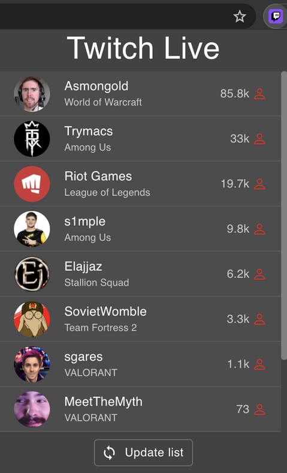
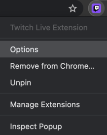
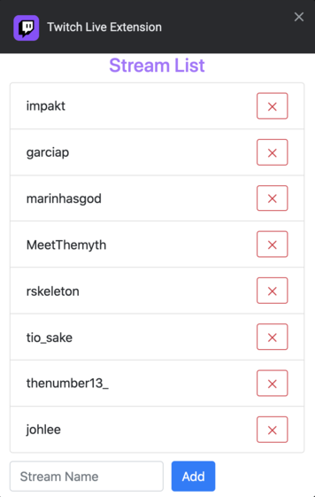

# Twitch Live Extension

Chrome extension that shows your favorite streamers live on Twitch. Everytime you add/remove a stream, it will sync with your Google account so that you have access to the updated list in any computer that you have logged in.

### Add a stream

- Press right click on the extension icon
- Select **_Options_**

- Add the stream name to the list by pressing `Enter` or clicking `Add` button

### Remove stream
- Press right click on the extension icon
- Select **_Options_**
- Press remove button for the desired stream

## Available Scripts

Before running any command, you need to create a file with your Twitch Client ID. 
To get one, go to the [Twitch Api page](https://dev.twitch.tv/docs/authentication#registration) and register your app.
 
 After that, create the file `./src/config.ts` with:  
``export const CLIENT_ID = "YOUR_CLIENT_ID";``

### `yarn start`

Runs the app in the development mode with reloading. 
Open [http://localhost:3000](http://localhost:3000) to view it in the browser.

### `yarn build`

Builds the app for production to the `build` folder without inline scripts. 

## Deployment

- Run `yarn build`.
- Open [chrome://extensions](chrome://extensions)
- Enable `Developer mode`
- Press ``Load unpacked`` and upload the ``build`` folder 

## Frameworks

This extension was developed using [React](https://reactjs.org/) and [Redux Toolkit](https://redux-toolkit.js.org/). For the options page, it was used [Jquery](https://jquery.com/).
