# Twitch Live Extension
[](https://chrome.google.com/webstore/detail/twitch-live-extension/nlnfdlcbnpafokhpjfffmoobbejpedgj)
[](https://chrome.google.com/webstore/detail/twitch-live-extension/nlnfdlcbnpafokhpjfffmoobbejpedgj)
[](https://chrome.google.com/webstore/detail/twitch-live-extension/nlnfdlcbnpafokhpjfffmoobbejpedgj)


[](https://addons.mozilla.org/en-US/firefox/addon/twitch-live-extension/)
[](https://addons.mozilla.org/en-US/firefox/addon/twitch-live-extension/)
[](https://addons.mozilla.org/en-US/firefox/addon/twitch-live-extension/)

A browser extension that will help you find out when your followed streamers are live on Twitch
and will send notifications when they go live.

## Disclaimer

> Firefox version is behind Chrome one and it will continue for a few more months until Firefox fully supports Manifest Version 3. Currently, they don't support [service_workers](https://github.com/mozilla/web-ext/issues/2532) that I use for authentication, went live notifications and the number on the badge icon. As soon as this feature is implemented, I'll release the recent version for Firefox too.

## Table of Contents

* [How to Use ](#how-to-use)
* [Explore Top Livestreams](#explore-top-livestreams)
* [Settings](#settings)
* [Available Scripts](#available-scripts)
* [Deployment](#deployment)
* [Frameworks](#frameworks)
* [Resources](#resources)
* [Contribution](#contribution)
* [License](#license)

## How to use
To start using it, open it, log in with your Twitch account, so that the extension can have access to your follows, and, every time you click on the extension icon,
you will see the streamers that you follow that are live.

This extension supports _**Just Went Live**_ notifications. If you want to enable them, open the extension, go to **Settings** and enable the _Just Went Live_ notifications.

There's also a button to log out of the Twitch account you are using on the extension.

The extension is available for [Chrome/Microsoft Edge](https://chrome.google.com/webstore/detail/twitch-live-extension/nlnfdlcbnpafokhpjfffmoobbejpedgj?hl=pt-PT&authuser=0) and [Firefox](https://addons.mozilla.org/en-US/firefox/addon/twitch-live-extension/).

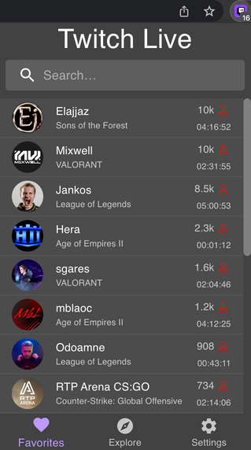
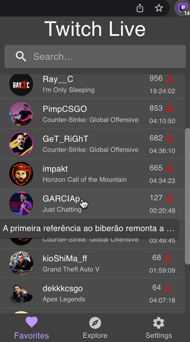
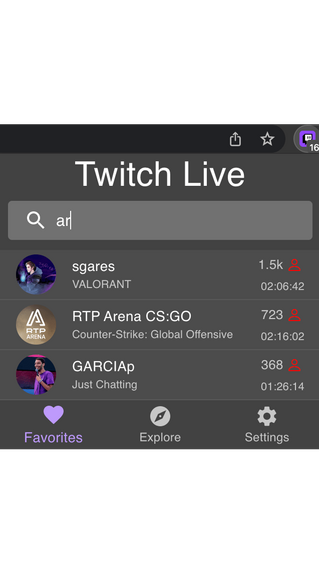

## Explore Top Livestreams

On the Explore tab, you can see the livestreams with most viewers in descending order. Once you reach the bottom of the list, more streams will be loaded.

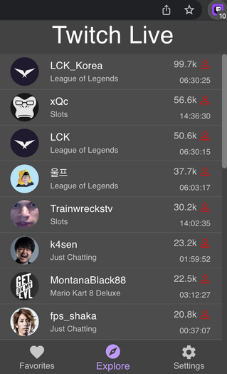
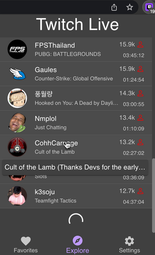


## Settings

In this page you can:
- Log out Twitch account
- Enable/Disable _just went live_ notifications

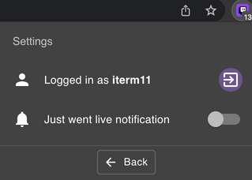


## Notifications
### **MacOS**

### Google Chrome


#### Firefox

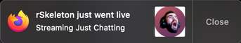

In order to have Firefox notifications on Mac, you need to search for _Notifications_ on spotlight
and enable them like this:

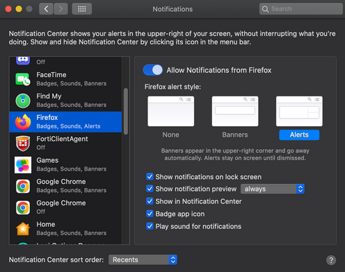

#### Microsoft Edge

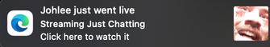


### **Windows**

#### Google Chrome


For **Windows** users, you might get annoyed with the sound from **Chrome Notifications**. You can disable it by:

- Select the Windows Start  button, and then select Settings
- Go to System > Notifications & actions
- Scroll down to "Google Chrome" and click the Chrome icon to open the notification settings
- Toggle "Play a sound when a notification arrives" to Off

#### Firefox

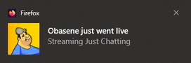

#### Microsoft Edge

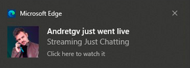

## Available Scripts

Before running any command, you need to create a file with your Twitch Client ID.
To get one, go to the [Twitch Api page](https://dev.twitch.tv/docs/authentication#registration) and register your app.

After that, create the file `./src/config.ts` with: <br>

```javascript
export const CLIENT_ID = "YOUR_CLIENT_ID";

export const RESPONSE_TYPE_TOKEN = 'token';

export const SCOPES: string[] = ['user:read:follows'];

export const OAUTH_BASE_URL = 'https://id.twitch.tv/oauth2';

export const API_BASE_URL = 'https://api.twitch.tv/helix';
```

### `yarn start`

Runs the app in the development mode with reloading.<br />
Open [http://localhost:3000](http://localhost:3000) to view it in the browser.

### `yarn test`

Runs all the tests

### `yarn build`

Builds the app for production to the `build` folder without inline scripts.<br />

## Deployment

- Run `yarn build`.
- Open [chrome://extensions](chrome://extensions)
- Enable `Developer mode`
- Press `Load unpacked` and upload the `dist` folder

## Frameworks

This extension was developed using [React](https://reactjs.org/), [Zustand](https://github.com/pmndrs/zustand) and [Material-UI](https://material-ui.com/).

## Resources
[Changelog](https://github.com/PedroS11/twitch-live-extension/blob/master/CHANGELOG.md)

## Contribution

### Youtube
- [Kr4vzz](https://youtube.com/kr4vzz)

### Twitch
- [Garciap](https://twitch.tv/Garciap)

- [Obasene](https://www.twitch.tv/obasene)

- [rSekeleton](https://twitch.tv/Rsekeleton)

- [Johlee](https://twitch.tv/Johlee)

- [Andretgv](https://twitch.tv/Andretgv)

- [Thenumber13_](https://twitch.tv/Thenumber13_)

- [Impakt](https://twitch.tv/Impakt)

- [Tio Sake](https://twitch.tv/Tio_sake)

- [MeetTheMyth](https://twitch.tv/MeetTheMyth)

- [Vertigo](https://twitch.tv/Vertigob)

- [Oryon](https://twitch.tv/Oryonp)

- [Pinkly](https://twitch.tv/Pinklytv)

- [Ka1one](https://twitch.tv/Ka1one)

- [RafikiHd](https://twitch.tv/RafikiHD)

### Graphic Designer
- [PiwDuarte](https://twitter.com/piwduarte)

And everyone else that gave feedback and suggestions.

## Problems or issues?

If you encounter any problems, bugs or other issues with the repo, please create an [issue in the GitHub repo](https://github.com/PedroS11/twitch-live-extension/issues).

## License

[BSD-Clause 3](https://github.com/PedroS11/twitch-live-extension/blob/master/LICENSE.md)

## Donation

If you appreciated this extension and want to help me, feel free to do it!

[](https://www.paypal.com/donate/?hosted_button_id=2EUE3TRXGC4KQ)
