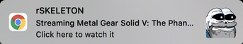
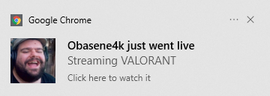

# Twitch Live Extension 

A browser extension that will help you to find out when your followed streamers are live on Twitch 
and will send notifications when they go live.
## Table of Contents

  * [Settings](#settings)
  * [Available Scripts](#available-scripts)
  * [Deployment](#deployment)
  * [Frameworks](#frameworks)
  * [Resources](#resources)
  * [Contribution](#contribution)
  * [License](#license)

 
To start using it, open it, log in with your Twitch account, so that the extension can have access to your follows, and, every time you click on the extension icon,
you will see the streamers that you follow that are live.

This extensions supports _**Just Went Live**_ notifications. If you want to enable them, open the extension, go to **Settings** and enable the _Just Went Live_ notifications.

There's also a button to switch the Twitch account you are logged in.

The extension is available on [Chrome Store](https://chrome.google.com/webstore/detail/twitch-live-extension/nlnfdlcbnpafokhpjfffmoobbejpedgj?hl=pt-PT&authuser=0). 

## Settings

In this page you can:
 - Switch Twitch account
 - Refresh the stored follows list
 - Enable/Disable _just went live_ notifications
 

### Notifications
## **MacOS**
 

## **Windows**

For **Windows** users, you might get annoyed with the sound from **Chrome Notifications**. You can disable it by:

- Select the Windows Start  button, and then select Settings
- Go to System > Notifications & actions
- Scroll down to "Google Chrome" and click the Chrome icon to open the notification settings
- Toggle "Play a sound when a notification arrives" to Off

## Available Scripts

Before running any command, you need to create a file with your Twitch Client ID. 
To get one, go to the [Twitch Api page](https://dev.twitch.tv/docs/authentication#registration) and register your app.
 
 After that, create the file `./src/config.ts` with:  
``export const CLIENT_ID = "YOUR_CLIENT_ID";``

### `yarn start`

Runs the app in the development mode with reloading. 
Open [http://localhost:3000](http://localhost:3000) to view it in the browser.

### `yarn test`

Runs all the tests

### `yarn build`

Builds the app for production to the `build` folder without inline scripts. 

## Deployment

- Run `yarn build`.
- Open [chrome://extensions](chrome://extensions)
- Enable `Developer mode`
- Press ``Load unpacked`` and upload the ``build`` folder 

## Frameworks

This extension was developed using [React](https://reactjs.org/), [Redux Toolkit](https://redux-toolkit.js.org/) and [Material-UI](https://material-ui.com/).

## Resources
[Changelog](https://github.com/PedroS11/twitch-live-extension/blob/master/CHANGELOG.md)

## Contribution

### Youtube
- [Kr4vzz](https://youtube.com/kr4vzz)

### Twitch
- [Garciap](https://twitch.tv/Garciap)

- [Thenumber13_](https://twitch.tv/Thenumber13_)

- [Impakt](https://twitch.tv/Impakt)

- [Tio Sake](https://twitch.tv/Tio_sake)

- [MeetTheMyth](https://twitch.tv/MeetTheMyth)

- [Johlee](https://twitch.tv/Johlee)

- [Obasene](https://www.twitch.tv/obasene)

- [rSekeleton](https://twitch.tv/Rsekeleton)

- [Vertigo](https://twitch.tv/Vertigob)

- [Oryon](https://twitch.tv/Oryonp)

- [Pinkly](https://twitch.tv/Pinklytv)

- [Ka1one](https://twitch.tv/Ka1one)

- [RafikiHd](https://twitch.tv/RafikiHD)

And everyone else that helped testing and I didn't mention.

## Problems or issues?
 
 If you encounter any problems, bugs or other issues with the repo, please create an [issue in the GitHub repo](https://github.com/PedroS11/twitch-live-extension/issues). 

## License 

[BSD-Clause 3](https://github.com/PedroS11/twitch-live-extension/blob/master/LICENSE.md)

## Donation

If you appreciated this extension and want to help me, feel free to do it!

