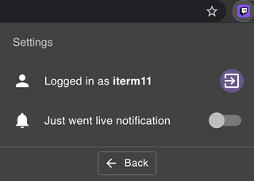
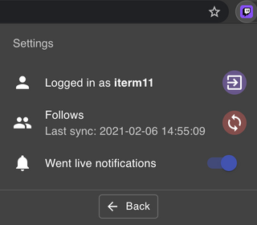

# Twitch Live Extension v2.2.0

_*Just went live*_  notifications are now available on **Twitch Live extension**. 

Every time, a streamer that you follow goes live, it will prompt a browser notification 
that you can click and it will open the live stream. 
This feature is disabled by default, in order to enable it:
- Open the extension

- Click on Settings 

- And enable it

### Notifications
 - **MacOS**
 

- **Windows**

 

