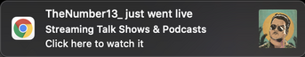

# Twitch Live Extension v2.2.0

_*Just went live*_  notifications are now available on **Twitch Live Extension**!

Every time, a streamer that you follow goes live, it will prompt a browser notification 
that you can click and it will open the live stream. 
This feature is disabled by default, in order to enable it:
- Open the extension → Go to Settings → Enable the notifications

For **Windows** users, you might get annoyed with the sound from **Chrome Notifications**. You can disable it by:

- Select the Windows Start  button, and then select Settings
- Go to System > Notifications & actions
- Scroll down to "Google Chrome" and click the Chrome icon to open the notification settings
- Toggle "Play a sound when a notification arrives" to Off

### Notifications
 - **MacOS**
 

- **Windows**

 

