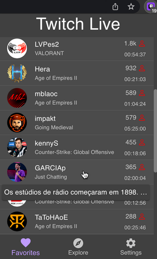

# Twitch Live Extension v3.0.2

**_Twitch Live Extension_ 3.0.2** comes with a feature asked for some people, a badge icon with the number of live streamers so you always have the count, even without opening it.
When a stream goes live/off, the count will be updated.

