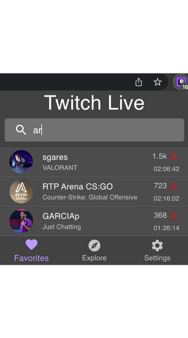

# Twitch Live Extension v4.1.0

You can now search through your followed live streams. 
While this is an experimental feature, you now have a search bar where you can type part or the complete username instead 
of scrolling through the list. If your input matches more than one stream, the extension will show them all.

If you find a bug with this new feature, you can report it [here](https://github.com/PedroS11/twitch-live-extension/issues)
as this is something new and some users have way more follows than me. 
On these scenarios, I'd like to know if you find any performance issues. If not, I may add the search bar to the Top Streams page too!

